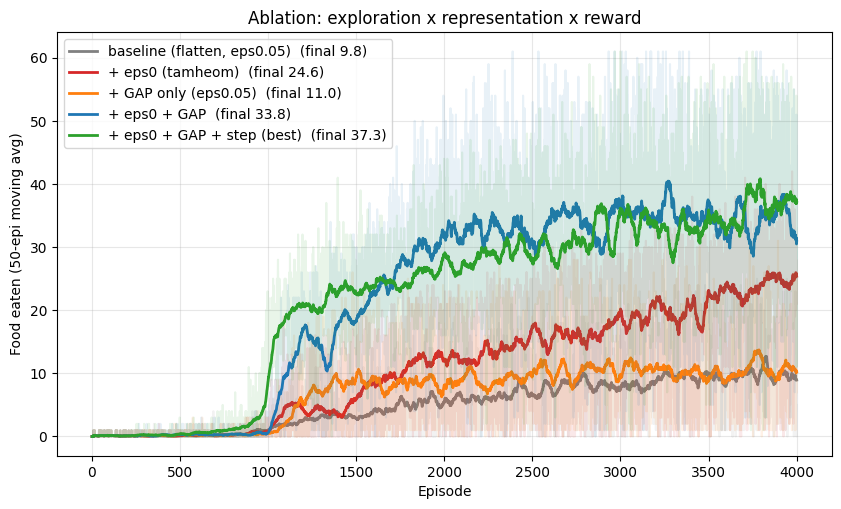

# Snake DQN

DQN agents for Snake on an 8×8 board (61 food = board full), trained on CPU. Two encoders: a CNN on the 4-channel grid and an MLP on 8-ray features. Course project, Reinforcement Learning, Pusan National University, 2026.

## Results

Food eaten, mean of the last 300 episodes (one seed, 3,000–4,000 episodes):

| Encoder | Configuration | Score |
|---|---|---|
| CNN | baseline (flatten head, ε_min 0.05) | 9.8 |
| | ε_min 0 | 24.6 |
| | ε_min 0 + global average pooling | 33.8 |
| | + reward (death −14, step −0.25, food +10) | **37.3** |
| MLP | Double DQN | 8.8 |
| | + ε_min 0 + reward (death −12, food +10) + 3-step returns + PBRS | 32.0 |
| | same, 10-step returns | **43.6** |

Both encoders reach the perfect game of 61 in individual episodes.

<p align="center">
  
  
</p>

- ε_min = 0: a 5% random-action floor kills a long snake ([gif](report/figs/eps_crash_short.gif)); removing it gives 9.8 → 24.6 ([curve](figures/2_eps_min_zero_vs_baseline.png)).
- Global average pooling helps only with ε_min = 0 (11.0 alone, 33.8 together) ([curve](figures/3_ablation_eps_gap.png)).
- Reward grid, death × step penalty: step −0.25 is best, −0.5 hurts everywhere ([heatmap](figures/4_reward_grid_heatmap.png)).
- n-step returns matter most for the MLP: 1-step 20.2, 3-step 32.0, 10-step 43.6; removing PBRS or Double costs less ([bars](figures/feat_ablation.png)).

One seed per configuration; curves are still rising at the end of training.

## Course report

Original notebooks with outputs (Korean): [1 baseline](report/1_baseline.ipynb) · [2 ε_min = 0](report/2_eps_min_zero.ipynb) · [3 global average pooling](report/3_global_average_pooling.ipynb) · [4 reward grid, ablation, limitations](report/4_reward_grid_and_ablation.ipynb)

## Run

```bash
pip install -r requirements.txt
python train.py configs/cnn_grid_d14_s0.25.json   # best CNN, ~80 min on 8 threads
python train.py configs/feat_full_n10.json         # best MLP, ~35 min
python analysis/plot_feat_ablation.py
```

`results/` holds the histories of all 21 runs above and the best models; runs are seeded and deterministic on CPU. `snake_env.py` is the course-provided environment, unmodified.
