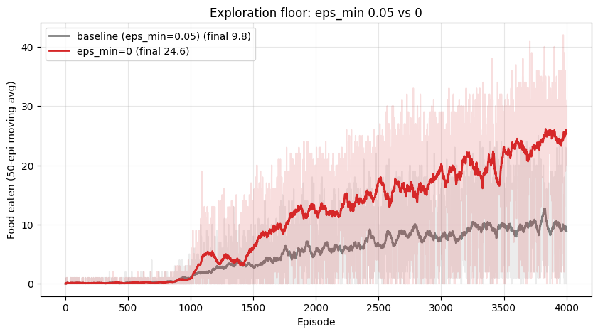
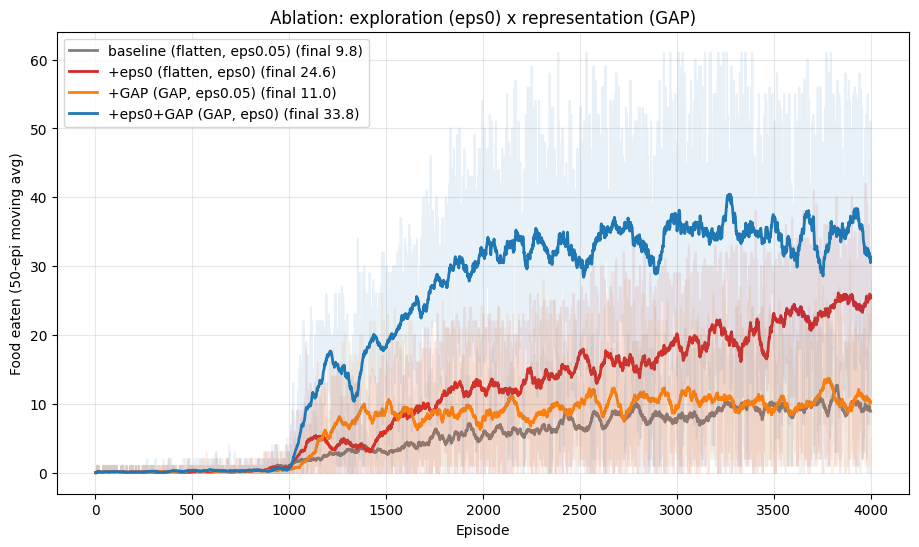
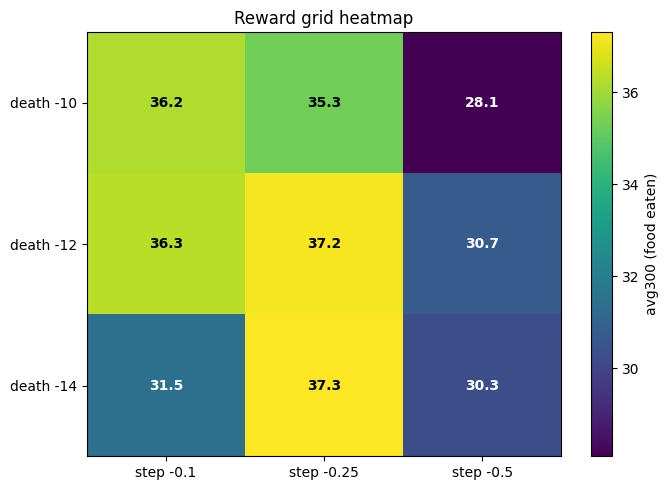

# Snake DQN

DQN for Snake on an 8×8 board, trained on CPU; a perfect game is 61 food (the board is full). Course project, Reinforcement Learning, Pusan National University, Spring 2026. Four steps, each changing one thing and compared with the previous run. Scores are the mean food eaten over the last 300 of 4,000 episodes, one seed.

## 1. Baseline: 9.8

CNN on the 4-channel grid (body / head / tail / food, binarized), flatten head, ε linearly decayed to a floor of 0.05. Plateaus around 10 ([curve](figures/1_baseline_curve.png)). [notebook](report/1_baseline.ipynb)

## 2. ε_min = 0: 24.6

Hypothesis: the 5% random-action floor is what limits the agent. Once the snake is long, a single random move ends the game ([gif](report/figs/eps_crash_short.gif)). Setting ε_min = 0 and changing nothing else gives 9.8 → 24.6. [notebook](report/2_eps_min_zero.ipynb)

<p align="center"></p>

## 3. Global average pooling: 33.8

Hypothesis: the flatten head overfits absolute positions, while what matters is where the food and the body are relative to the head. Replacing flatten with global average pooling gives 11.0 on its own (the ε floor still limits it) and 33.8 together with ε_min = 0. [notebook](report/3_global_average_pooling.ipynb)

<p align="center"></p>

## 4. Reward shaping: 37.3, and a perfect game

With ε_min = 0 and GAP fixed and food reward +10, a 3×3 grid over death penalty {−10, −12, −14} × step penalty {−0.1, −0.25, −0.5}. A step penalty of −0.25 is best and −0.5 hurts at every death penalty; death −14 / step −0.25 reaches 37.3 and fills the board in some episodes. [notebook](report/4_reward_grid_and_ablation.ipynb)

<p align="center">
  
  
</p>

<p align="center"></p>

## Limitations

One 8×8 board with one food item; one seed per configuration; curves still rising at 4,000 episodes.

## Run

```bash
pip install -r requirements.txt
python train.py configs/cnn_grid_d14_s0.25.json   # step 4 best, ~80 min on 8 threads
```

`results/` holds the histories of all 13 runs and the best model. Runs are seeded. `snake_env.py` is the course-provided environment, unmodified.
